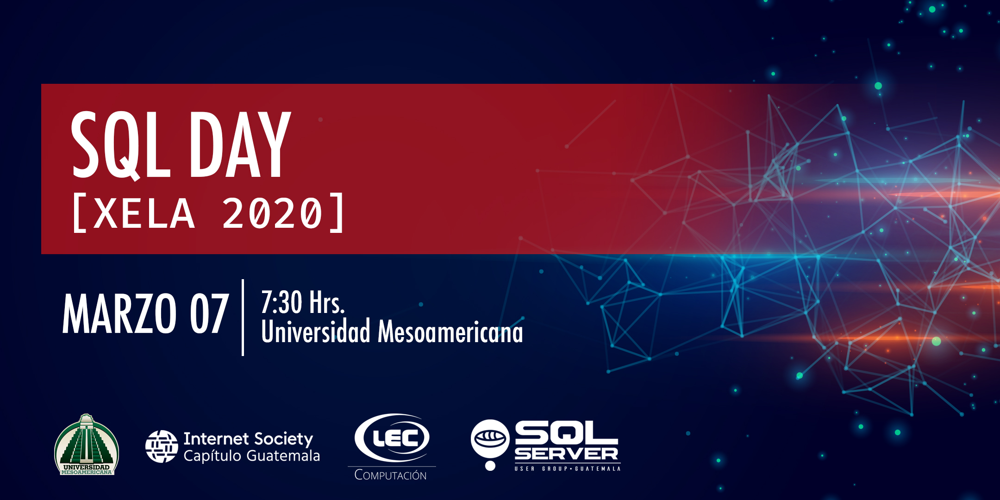

# Agenda

## Apertura
Hora | Actividad |
--- | --- |
07:30 - 08:00 AM | Registro
08:00 - 08:10 AM | Bienvenida / Keynote
08:10 - 08:15 AM | Coffee break - Cortesía de [Lec Computación](http://www.leccomputacion.com)

## Primer bloque 
Hora | Sesion | Speaker |
--- | --- | --- |
08:15 - 09:15 AM | Introducción a containers con Docker | Marlon Coti
09:15 - 10:15 AM | SQL Server - La plataforma de datos moderna | Carlos Lopez
10:15 - 11:15 AM | Análisis de datos con PowerBI y SQL Server | Vicente Suc
11:15 - 11:45 PM | Que es DevOps? | Jose Ordoñez
11:45 - 12:00 PM | Sociedad de la Internet capítulo Guatemala | Manuel Rodas

## Almuerzo
Hora | Actividad
--- | --- 
12:00 - 01:00 PM | Lunch - Cortesía de [Internet Society - Capítulo Guatemala](https://www.isoc.org.gt)

## Segundo bloque

Hora | Sesion | Speaker |
--- | --- | --- |
01:00 - 02:00 PM | Conociendo la plataforma .NET Core | Geovani De León
02:00 - 03:00 PM | Cloud Computing con Microsoft Azure | Jose Ordoñez

## Workshop

Hora | Actividad
--- | --- 
03:00 - 04:00 PM | Taller práctico sobre Docker / SQL Server

## Cierre
Hora | Actividad 
--- | --- 
04:00 - 04:10 PM | Coffee break - Cortesía de [Guatemala SQL Server User Group](http://facebook.com/groups/gtssug/)
04:10 - 04:30 PM | Cierre del evento / Rifa

# ¿Dudas?
Para más información y registro de este evento click [aqui](https://gtssug-sqlday-xela2020.eventbrite.com).  
Seguinos en [Facebook](https://www.facebook.com/groups/gtssug/) para conocer mas acerca de este y otros eventos.

# Siguenos
 
