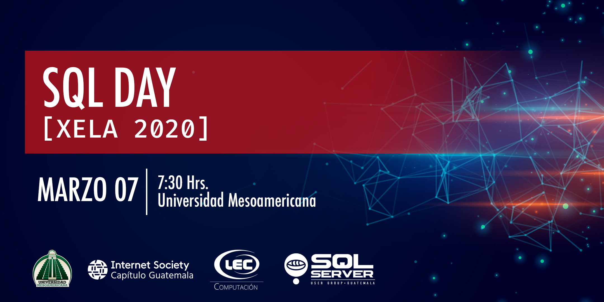

# Presentaciones

Sesion | Speaker
--- | --- 
Introduccion a containers con Docker | [Marlon Coti](./files/)
SQL Server - La plataforma de datos moderna | [Carlos Lopez](./files/)
Análisis de datos con PowerBI y SQL Server | [Vicente Suc](./files/)
Conociendo la plataforma .NET Core | [Geovani De Leon](./files/)
Cloud Computing con Microsoft Azure | [Jose Ordoñez](./files/)

# ¿Dudas?
Para más información y registro de este evento click [aqui](https://sqlconnect_2019.eventbrite.com).  
Seguinos en [Facebook](https://www.facebook.com/groups/gtssug/) para conocer mas acerca de este y otros eventos.

# Follow us
 