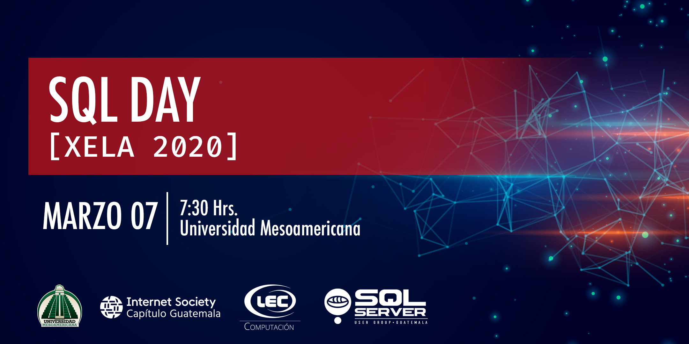

# Guia para la preparacion del laboratorio

Este laboratorio puede ser llevado a cabo en cualquier maquina que soporte Docker.
Esta diseñado para correr en una maquina, por ejemplo una laptop corriendo Windows o Linux.
Todo el laboratorio esta basado en software que puede ser bajado gratuitamente desde el sitio de Docker y VisualStudioCode.

## Pasos para la preparacion del laboratorio

Por favor completa estos pasos en tu computadora personal antes de asistir al evento, esto ayudara a agilizar el laboratorio y te ayudara a tener mas tiempo para trabajar en el ejercicio.
#
1. Descarga e instala [Visual Studio Code](https://code.visualstudio.com/), Te servira como Editor de codigo.

#
2. Crea una cuenta en  [Docker](https://docker.com).

#
3. Descarga e instala [Docker](https://docker.com)

        Windows Home   [Docker Toolbox](https://github.com/docker/toolbox/releases)

        Windows Pro    [Docker Desktop](https://hub.docker.com/editions/community/docker-ce-desktop-windows/)

        Linux          [Docker en Linux](https://runnable.com/docker/install-docker-on-linux)

        Virtual Lab    [play with docker](https://labs.play-with-docker.com)

Listo!
Esperamos verte ahi!
